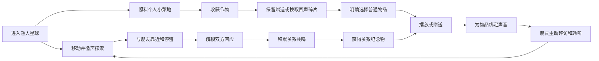

# 3D 球形声音世界核心循环 V0.2

**工作名称：** 待定（《回声小屋》不再作为正式名称）  
**文档版本：** V0.2  
**日期：** 2026-07-26  
**状态：** 已完成内部产品审批，可用于后端边界与下一轮多人灰盒设计  

## 1. 本版要解决的问题

本版定义正式多人方向中的最小核心循环：

> 玩家进入一个熟人共享的小型 3D 星球  
> → 通过移动和距离听见其他玩家  
> → 通过轻量种植获得“回声碎片”  
> → 用碎片明确选择普通物品  
> → 靠近朋友并自然停留，解锁一次双方回应  
> → 通过回应积累关系“共鸣”，获得共同纪念物  
> → 将物品摆放在星球上并绑定声音  
> → 自己或朋友靠近物品、主动点击并听见完整声音  
> → 物品成为新的声音地点，促使玩家再次拜访、相遇和赠送

本版的目标不是建立复杂经营，而是让个人照料提供稳定的普通资源，让朋友声音与双方回应继续承担最珍贵的关系价值。

## 2. 已确认的产品前提

1. 世界采用小型 3D 球形空间，不再以室内小屋作为正式空间结构。
2. 每名真实玩家创建并控制一个小人角色，不允许控制其他玩家角色。
3. 玩家声音根据玩家之间的球面距离连续衰减，允许多人声音自然重叠。
4. 物品仍然可以绑定声音、摆放在空间中，并在靠近后主动点击聆听。
5. 正式多人版本需要账号、服务器、实时位置同步、声音资源与持久化数据。
6. 产品优先服务相互认识的小型熟人群体，不以陌生人广场为 V0.2 目标。
7. “回声碎片”是普通物品的暂定消费资源，不等于正式视觉或品牌中的金币。
8. “共鸣”是两名玩家之间的关系进度，不是可自由消费、购买或转移的货币。
9. 星球提供极轻量种植，但不扩张为完整农场、烹饪或制作游戏。

## 3. V0.2 世界模型

### 3.1 星球房间

- 一个星球房间由邀请关系建立，仅对成员开放；
- V0.2 每个星球最多 4 名正式成员；
- 一个玩家在 V0.2 只加入一个主要星球，暂不处理多星球管理；
- 成员可以同时在线，也可以在不同时间访问星球上已经保存的物品；
- 玩家相遇奖励只在双方同时在线时成立；
- 物品和绑定声音长期保存在星球中，允许异步拜访与聆听。

### 3.2 角色

- 每个账号对应一个本人控制的小人角色；
- 每个角色包含名字、基础外观、当前位置和当前角色声音；
- 客户端负责输入和表现，服务器对最终位置与相遇事件具有权威；
- 每台设备以本机角色作为聆听位置；
- 角色之间不形成刚性碰撞，避免多人聚集时互相阻挡。

## 4. 核心循环

循环中的情感奖励是“听见朋友、被朋友发现、得到回应、留下共同痕迹”。回声碎片解决个人可持续获得普通物品的问题；共鸣只记录关系进展。

## 5. 玩家相遇

### 5.1 距离层级

玩家之间使用球面弧长，而不是穿过星球内部的直线距离。

| 层级 | 作用 | V0.2 规则 |
| --- | --- | --- |
| 最大聆听范围 | 开始或结束听见对方 | 使用声音衰减配置 |
| 清晰聆听范围 | 对方声音具有明确存在感 | 使用声音清晰距离配置 |
| 相遇范围 | 判断两人是否足够靠近 | 默认等于或略小于清晰聆听范围 |

距离参数必须继续由配置管理，不写死在服务端业务规则中。

### 5.2 有效相遇条件

一次“有效相遇”需要同时满足：

1. 两名玩家属于同一个星球房间；
2. 双方同时在线且账号状态正常；
3. 双方连续处于相遇范围内至少 20 秒；
4. 短暂离开范围不超过 3 秒时，可以继续累计本次停留；
5. 双方在最近 60 秒内至少有一次有效输入或移动，不把长期挂机计为相遇；
6. 本次相遇未被服务器使用同一幂等标识确认。

有效相遇不要求玩家正在说话，也不依赖某段声音是否刚好处于播放周期，避免网络、静默间隔或音频失败影响关系判定。

### 5.3 相遇反馈

- 进入范围时不立刻显示任务进度条；
- 有效相遇成立后解锁一次轻量“回应”机会；
- 不播放奖励金币音效，不覆盖朋友声音；
- 不显示货币掉落，不自动增加共鸣；
- 任何一方可以发起回应，对方可以接受、忽略或拒绝；
- 只有双方完成回应后才增加关系共鸣；
- 同一对玩家当天后续相遇仍可自然发生，但每天只允许一次产生共鸣的回应。

## 6. 双层资源

### 6.1 回声碎片

回声碎片用于选择普通物品，主要来自个人可完成的轻量种植。玩家不需要等待朋友上线才能获得基础布置资源。

V0.2 规则：

- 收获作物后，玩家可以保留作物或将其兑换为回声碎片；
- 回声碎片不可玩家间转账，不可赠送，不可兑换现金；
- V0.2 不出售回声碎片，不接入付费购买；
- 不根据在线时长、移动距离、声音播放次数、说话时长或物品点击次数发放；
- 每日种植产出有柔和上限，但不会因错过登录而扣除或清空资源。

### 6.2 共鸣关系进度

共鸣属于一对玩家关系，不属于单个玩家钱包。

- 有效相遇只解锁回应，不直接增加共鸣；
- 一方发起回应，另一方明确接受后，共鸣进度增加 1；
- 同一对玩家每 24 小时最多通过回应增加 1 点共鸣；
- 共鸣不能购买、赠送、交易或兑换普通物品；
- 共鸣用于关系能力、共同纪念物和未来的共同空间权限；
- 拒绝或忽略回应不会扣除关系进度，也不会向其他成员公开。

### 6.3 服务器要求

- 回声碎片余额必须来自不可变更的服务端账本；
- 每笔碎片记录包含来源、关联收获、数量和时间；
- 购买物品与扣除碎片必须在同一事务内完成；
- 共鸣记录包含玩家对、关联相遇、双方回应和时间；
- 任何重试不得重复发放或重复扣除；
- 客户端只展示结果，不能直接修改余额。

## 7. 轻量种植

### 7.1 定位

种植是普通资源的稳定来源，也是朋友拜访时自然停留的小型地点。它不能成为比循声探索更复杂的主玩法。

### 7.2 菜地容量与权限

- 每名玩家拥有 4 个个人种植格；
- 菜地位于共享星球，但所有权属于对应玩家；
- 只有主人可以播种、收获、移除或兑换作物；
- 访客可以每天为每块生长中的菜地浇水一次；
- 浇水只提供小幅生长帮助和访问痕迹，不产生货币或共鸣；
- 访客不能收获、出售、移动或覆盖他人的作物。

### 7.3 首批作物

| 作物代号 | 默认成熟时间 | 基础用途 | 默认碎片价值 |
| --- | ---: | --- | ---: |
| `quick_crop` | 4 小时 | 快速回访、小额资源 | 1 |
| `daily_crop` | 8 小时 | 日常稳定资源 | 2 |
| `gift_crop` | 20 小时 | 赠送或较高资源 | 3 |

正式作物名称和外观属于美术与世界观阶段，当前只使用规则代号。

### 7.4 生长规则

- 播种后按服务器时间自然生长；
- 作物永不枯死，不因未登录受到惩罚；
- 不要求反复浇水，不加入肥料、品质、病虫害和季节；
- 主人浇水不是成熟的强制条件；
- 朋友浇水可以缩短少量时间，但每个生长周期存在总加速上限；
- 收获时返还基础种子，避免玩家因资源不足失去种植能力；
- 收获物可以保留为赠礼，或由主人主动兑换为回声碎片；
- V0.2 不加入烹饪、配方、合成、工具耐久和作物市场。

### 7.5 防刷与时间一致性

- 种植、浇水、成熟、收获和兑换均由服务器确认；
- 客户端时间不参与成熟判定；
- 同一生长周期的收获和兑换必须支持幂等重试；
- 每日可兑换碎片存在配置上限，超出部分作物仍可保留或赠送；
- 多账号互相浇水不能直接产出碎片或共鸣。

## 8. 物品获得

### 8.1 物品分层

#### 普通物品

- 用于声音绑定、布置与赠送；
- 来自新手包或使用回声碎片明确选择；
- 不采用随机抽取；
- 不设置限时抢购和错过焦虑；
- 同类物品可以拥有多个实例。

#### 关系纪念物

- 来自首次有效相遇、重复拜访或关系里程碑；
- 不能直接用回声碎片购买；
- 与产生它的玩家关系关联；
- V0.2 不允许交易或转赠；
- 具体里程碑数量在真实多人测试后确定。

### 8.2 新手物品

新玩家首次进入星球时直接获得 3 件基础普通物品：

- 一件适合短语音的桌面或地面小物；
- 一件轮廓明显、适合作为声音地标的中型物品；
- 一件适合赠送的轻量小物。

新玩家不需要先完成相遇或积累共鸣，才能体验声音绑定和摆放。

### 8.3 回声碎片物品库

V0.2 使用一个小型固定物品库：

- 建议首批 6—8 种普通物品；
- 每件价格为 2—6 点回声碎片；
- 玩家明确选择后立即获得对应物品实例；
- 不做每日轮换、稀有概率、宝箱、合成和升级；
- 物品差异优先体现在声音记忆的表达方式，不提供数值属性。

## 9. 物品状态与声音规则

### 9.1 物品实例状态

一个物品实例只处于以下一种主要状态：

1. `inventory`：位于拥有者背包，可摆放或赠送；
2. `placed`：已摆放在星球合法位置；
3. `gift_pending`：已发起赠送，等待接收者决定；
4. `received`：赠送被接受后进入接收者背包，随后转为 `inventory`。

V0.2 不提供出售、分解、合成或永久销毁。玩家不需要的物品可以收回背包。

### 9.2 声音绑定

- 普通物品可以不绑定声音；
- 玩家只能为自己拥有的物品添加或替换声音；
- 声音保存成功前保留原绑定；
- 物品默认安静，玩家必须靠近并主动点击；
- 播放开始后即使玩家离开交互范围，声音仍完整播放；
- 同一设备同一时间只播放一个物品声音；
- 物品声音播放时，附近角色声音平滑退到背景，结束后恢复；
- 删除声音绑定不会删除物品实例。

## 10. 摆放

### 10.1 权限

- 玩家只能摆放、移动或收回自己拥有的普通物品；
- 其他玩家可以靠近和聆听，但不能修改物品；
- 关系纪念物的共同摆放权限暂不进入 V0.2，默认由获得该物品的一方管理；
- 星球房主不能任意编辑其他成员的声音内容，但可以执行必要的内容管理和移除。

### 10.2 球面位置

- 室内版本的合法格点改为球面合法摆放锚点或合法表面区域；
- 位置保存为球面方向、表面高度和朝向；
- 不允许摆放到不可见内部、角色出生点、移动禁区或已有占用范围；
- 物品不能阻断星球主要行走路径；
- 客户端预览位置，服务器验证并保存最终结果。

### 10.3 容量

- V0.2 每名玩家最多在星球上摆放 6 件物品；
- 四人星球最多同时存在 24 件已摆放物品；
- 背包内未摆放物品不占星球容量；
- 达到容量后允许移动、收回和替换，不允许新增摆放。

## 11. 赠送

### 11.1 基本规则

- 只能赠送自己背包中的普通物品；
- 收获后尚未兑换的作物也可以赠送；
- 已摆放物品需要先收回背包；
- 已绑定声音的物品不能直接赠送，避免未经确认转移私人声音；
- 回声碎片、共鸣关系进度和关系纪念物不能赠送；
- 发起赠送后物品进入 `gift_pending`，暂时不能再次摆放或赠送；
- 接收者必须明确接受，物品所有权才转移；
- 接收者拒绝或赠送过期后，物品自动退回赠送者背包；
- 接受赠送不会自动摆放，也不会自动播放声音。

### 11.2 防骚扰

- 每名玩家每天最多发起 3 次赠送；
- 接收者可以关闭某位玩家的赠送请求；
- 被屏蔽关系之间不能发起赠送；
- 拒绝赠送不触发公开提示，不要求说明理由；
- 赠送行为不产生回声碎片或共鸣，避免互刷。

## 12. 后端最小领域对象

| 对象 | 最小职责 |
| --- | --- |
| `User` | 账号、状态与安全设置 |
| `Character` | 本人角色、外观、名字与当前声音引用 |
| `Planet` | 星球实例、容量与基础配置 |
| `PlanetMember` | 成员关系、邀请与管理权限 |
| `PresenceSession` | 在线状态、近期活动与当前权威位置 |
| `Encounter` | 双方、开始时间、累计有效停留与回应资格 |
| `Relationship` | 无序玩家对、共鸣进度与已解锁关系能力 |
| `ResponseOffer` | 相遇中的回应发起、接受、拒绝和过期状态 |
| `FragmentLedger` | 回声碎片来源、支出、余额变化与幂等标识 |
| `GardenPlot` | 所有者、星球、种植格和访问权限 |
| `CropInstance` | 作物类型、播种时间、成熟时间、浇水和收获状态 |
| `ItemCatalog` | 物品类型、价格、可赠送性与容量信息 |
| `ItemInstance` | 唯一物品、拥有者、状态与声音绑定 |
| `Placement` | 星球、球面位置、朝向与占用范围 |
| `Gift` | 赠送者、接收者、物品和待处理状态 |
| `SoundAsset` | 文件状态、所有者、时长、访问权限与存储引用 |

## 13. 服务端事件

首版后端至少需要支持以下可审计事件：

- `presence.started`
- `presence.position_updated`
- `encounter.started`
- `encounter.qualified`
- `encounter.ended`
- `response.created`
- `response.accepted`
- `response.declined`
- `relationship.resonance_added`
- `crop.planted`
- `crop.watered`
- `crop.harvested`
- `crop.exchanged`
- `fragments.granted`
- `item.purchased`
- `item.placed`
- `item.moved`
- `item.picked_up`
- `item.sound_bound`
- `gift.created`
- `gift.accepted`
- `gift.declined`
- `gift.expired`

所有会改变回声碎片、关系共鸣、作物、物品所有权或声音绑定的事件必须由服务器确认并支持幂等重试。

## 14. 异常与失败规则

- 相遇中断连接：保留很短的断线宽限，超时后结束本次累计；
- 双方在边界反复进出：使用 3 秒离开宽限，避免频繁重置；
- 回应确认失败：保留双方最后确认状态，不重复增加共鸣；
- 收获失败：作物保持成熟未收获，不重复创建收获物；
- 兑换失败：保留作物，不增加碎片；
- 购买失败：不扣回声碎片、不创建物品；
- 摆放位置被抢占：服务器拒绝并要求重新选择，不覆盖已有物品；
- 赠送双方同时操作：以服务端首次有效状态转换为准；
- 声音上传失败：保留原声音绑定和物品状态；
- 玩家退出星球：个人物品先收回背包，声音资产根据保留策略处理，不直接转移给房主。

## 15. V0.2 明确不做

- 陌生人公共大厅；
- 竞技、任务、排行榜和连续签到；
- 回声碎片付费购买；
- 随机抽取、宝箱、稀有概率和限时商店；
- 物品数值属性、生产、合成、升级与耐久；
- 玩家间货币转账和自由交易市场；
- 根据录音内容、说话时长或播放次数发放奖励；
- 完整农场、烹饪、制作、配方、品质、肥料、天气和作物交易市场；
- 自动播放物品声音；
- 赠送带有私人声音的物品；
- 多星球旅行与跨服系统。

## 16. 首轮验证指标

### 相遇

- 玩家是否会因为声音主动靠近另一名玩家；
- 有效相遇前后的平均停留时长；
- 有效相遇后发起和接受回应的比例；
- 同一对玩家的重复拜访率。

### 种植与资源

- 播种、成熟、收获和兑换的完成率；
- 玩家平均每天实际需要操作的次数；
- 作物保留、兑换和赠送的比例；
- 没有朋友在线时，种植是否提供足够但不过量的个人目标；
- 玩家是否因为收菜忽视附近朋友声音。

### 物品

- 新玩家是否能完成首次摆放和声音绑定；
- 获得回声碎片后选择物品的比例；
- 已获得物品的摆放率；
- 物品声音被其他成员主动聆听的比例；
- 物品是否形成新的停留和相遇位置。

### 赠送

- 赠送发起率和接受率；
- 接收后被摆放或绑定声音的比例；
- 是否出现互刷、骚扰或囤积；
- 玩家是否认为赠送表达了关系，而不是转移库存。

## 17. V0.2 验收标准

1. 两名玩家在球面上移动时，可以按距离听见彼此；
2. 满足有效相遇条件后只解锁回应，不自动发放货币或共鸣；
3. 双方完成回应后，服务器每天只增加一次对应关系共鸣；
4. 玩家可以播种、等待、收获并将作物兑换为回声碎片；
5. 玩家可以使用回声碎片明确选择一个普通物品；
6. 购买与扣款保持原子一致；
7. 玩家可以在合法球面位置摆放、移动和收回自己的物品；
8. 玩家可以为自己的物品绑定声音，其他成员可以靠近后主动聆听；
9. 玩家可以发起一次不含声音的物品或作物赠送，接收者可接受或拒绝；
10. 赠送状态转换不会复制或丢失物品；
11. 不通过任务、排行榜、签到或付费货币驱动玩家靠近朋友。

## 18. 仍需后续验证的参数

以下数字是 V0.2 默认值，不是永久规则：

- 相遇范围与清晰聆听范围的比例；
- 有效相遇需要的 20 秒停留；
- 每对玩家每天 1 次共鸣回应；
- 4、8、20 小时的作物成熟时间；
- 每块菜地的访客浇水次数和加速上限；
- 每日可兑换回声碎片上限；
- 普通物品 2—6 点价格；
- 每人 6 件、全星球 24 件的摆放容量；
- 每天 3 次赠送上限；
- 关系纪念物的具体触发里程碑。

这些参数必须通过真实多人测试调整，不应在首版后端中写成不可配置常量。

## 19. 与旧版文档的关系

本文件暂时覆盖旧版文档中以下正式产品方向：

- “单一室内小屋”改为“小型 3D 球形星球”；
- “单设备控制多个角色”只保留为旧 Demo 验证方法，正式版改为一人一角色；
- “所有现场操作者可编辑任意物品”改为基于物品所有权的权限；
- “本地数据”改为服务端权威的角色、位置、物品、赠送、声音与共鸣数据；
- 合法格点原则保留，但在球面版本中改为合法摆放锚点或表面区域。
- 靠近不再自动发放共鸣；个人种植提供普通资源，双方回应提供关系进度。

旧版声音播放优先级、主动点击物品、完整播放和原子替换规则继续有效。旧文档暂不直接返修，待 V0.2 经过多人验证后统一升级版本。
